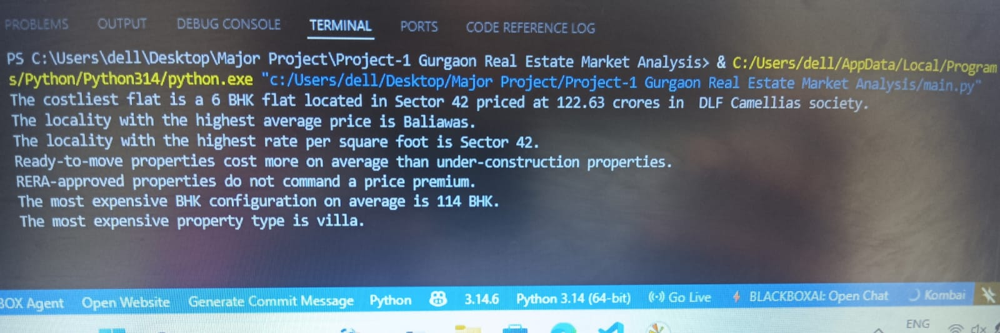
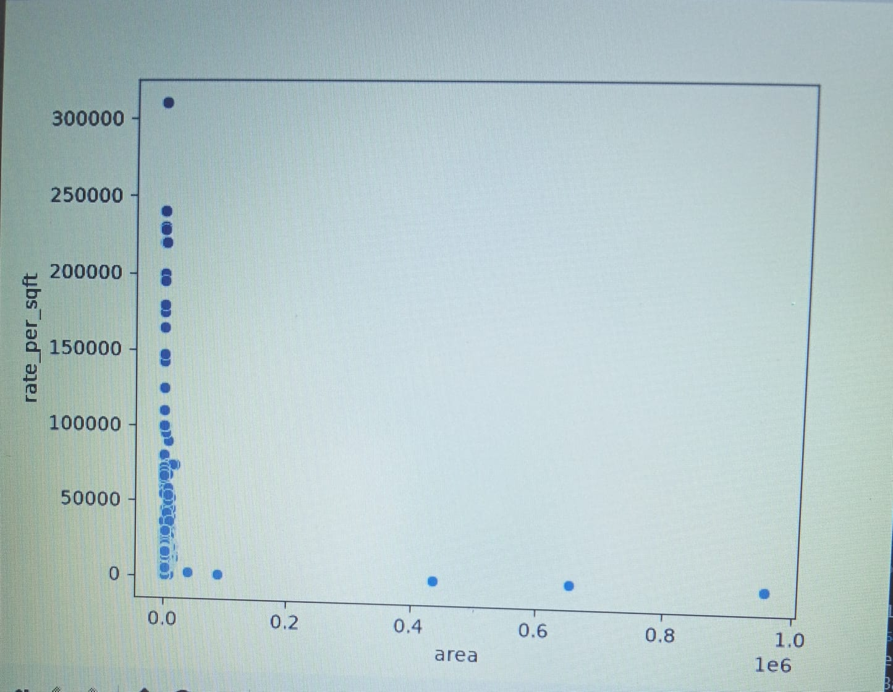

# 🏡 Gurgaon Real Estate Market Analysis

## 📌 Project Overview

This project analyzes the Gurgaon real estate market using Python and Exploratory Data Analysis (EDA). It provides valuable insights into property prices, locations, property types, and market trends to help buyers, investors, and real estate professionals make informed decisions.

---

## 🎯 Objectives

- Analyze property price distribution.
- Compare prices across different locations.
- Study the relationship between property area and price.
- Identify premium and affordable localities.
- Visualize market trends using charts and graphs.
- Generate meaningful insights from real estate data.

---

## 📂 Dataset

- **File:** `data.csv`
- **Format:** CSV
- **Source:** Public Real Estate Dataset

### Dataset Features

- Property Price
- Area (Sq. Ft.)
- Locality
- BHK Configuration
- Bathrooms
- Property Type
- Rate Per Sq. Ft.
- Property Status
- RERA Approval

---

## 🛠️ Technologies Used

- Python
- Pandas
- NumPy
- Matplotlib
- Seaborn
- VS Code

---

## 📊 Exploratory Data Analysis

The project includes:

- ✔ Data Cleaning
- ✔ Missing Value Handling
- ✔ Duplicate Removal
- ✔ Data Transformation
- ✔ Feature Engineering
- ✔ Statistical Analysis
- ✔ Data Visualization

---

# 📸 Project Screenshots

## 🖥️ Program Output

The program generates useful insights from the Gurgaon real estate dataset.

<p align="center">

</p>

---

## 📈 Area vs Rate Per Square Foot

The scatter plot shows the relationship between property area and rate per square foot. Most properties are concentrated within a smaller area range, while a few luxury properties appear as outliers.

<p align="center">

</p>

---

## 🔍 Key Insights

- The costliest flat is a 6 BHK apartment located in Sector 42 priced at ₹122.63 Crores.
- Baliawas has the highest average property price.
- Sector 42 has the highest average rate per square foot.
- Ready-to-move properties are generally more expensive than under-construction properties.
- Villas are the most expensive property type on average.
- Property prices generally increase with area.
- A few luxury properties behave as outliers.
- Location is one of the most important factors affecting property prices.

---

## 📁 Project Structure

```text
Gurgaon-Real-Estate-Market-Analysis/
│
├── data.csv
├── main.py
├── README.md
├── 1.jpeg
└── 2.jpeg
```

---

## ▶️ Installation

Clone the repository

```bash
git clone https://github.com/Silki-Pawar1628/Gurgaon-Real-Estate-Market-Analysis.git
```

Install required libraries

```bash
pip install pandas numpy matplotlib seaborn
```

Run the project

```bash
python main.py
```

---

## 🚀 Future Enhancements

- Build a Machine Learning model for property price prediction.
- Develop an interactive Power BI dashboard.
- Create a Streamlit web application.
- Add recent Gurgaon real estate datasets.
- Improve visualization with advanced charts.

---

## 👩‍💻 Author

**Silki Pawar**

B.Tech Computer Science & Engineering

Aspiring Data Analyst

**GitHub:** https://github.com/Silki-Pawar1628

---

### ⭐ If you found this project useful, don't forget to Star this repository.
